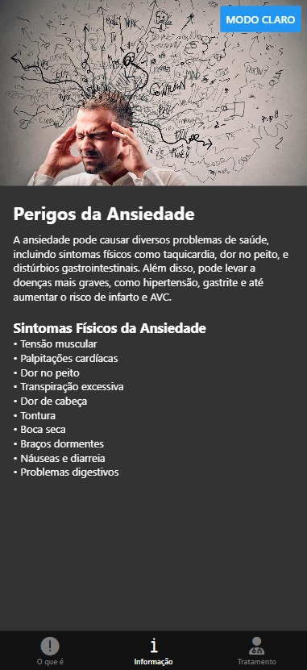

# App Sobre Ansiedade em React Native

Aplicativo móvel com informações sobre ansiedade, sintomas e tratamentos.

## Principais Recursos

- Alternância entre tema claro e escuro (agora é um íconezinho)
- Informações sobre tipos de ansiedade
- Lista de sintomas físicos
- Botão com link para mais informações

## Telas

1. **Tela Inicial**  
   - Explica o que é ansiedade  
   - Lista tipos (TAG, TP, TEPT, etc.)  
   - Botão para alternar tema
     

2. **Tela de Sintomas**  
   - Lista sintomas físicos  
   - Explica riscos para saúde  
   - Mesmo sistema de temas
     

3. **Tela de Ajuda**  
   - Como buscar tratamento  
   - Link para site externo  
   - Botão de ação
      

## Como Usar

1. Navegue entre as telas pelas abas inferiores
2. Toque no botão "Modo Escuro/Claro" para alternar temas
3. Use o botão "Saber mais" para acessar informações adicionais

## Tecnologias

- React Native
- Expo
- Componentes personalizados
- Navegação por tabs

# Por Leodair Erik (3°D)
